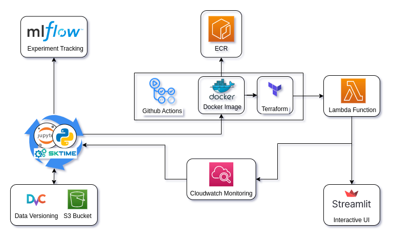

# Energy_forecast 

[](https://github.com/psf/black)  [](https://github.com/PyCQA/pylint)  [](https://github.com/PyCQA/pylint)  [](https://pycqa.github.io/isort/)  
    
[](https://adin786-energy-forecast.streamlit.app/) &larr; *Click here to open the deployed, interactive app!*

## Summary
  
In this project I demonstrate a simple architecture for serverless ML model deployment, building in MLOps principles such as experiment tracking, data versioning, CI/CD and monitoring.

**Purpose:** To show how MLOps principles can be used even in small scale, simple ML projects using only open source tools and free-tier cloud services.

The focus is on **minimal the time/effort to go from experimentation to a deployed model**... not specifically on sophisticated timeseries forecasting techniques.

## Technical highlights

- **Jupyter** for data exploration and experimentation 
- Custom **Python package** for refactoring code into a reusable pipeline
- **Sktime** as ML framework for timeseries
- **DVC** for data versioning, synced to **AWS S3**
- **Mlflow** for experiment tracking
- **AWS Lambda** for serverless model inference
- **Streamlit** web-app for interactive demo &rarr; [](https://adin786-energy-forecast.streamlit.app/)
- Automated **CI/CD pipeline** using **Github-actions** for the following:
  - Running **pre-commit** hooks for linting, style, type-checking
  - Running **pytest** for unit testing
  - Building **Docker** container image & push to **AWS ECR**
  - Deploying cloud infra using **Terraform** (infra-as-code)
- Monitoring using **AWS Cloudwatch**.

## Architecture diagram



--- 

# More Details

## Data source 

The energy consumption dataset comes from data.gov.uk: *"[Energy Trends](https://assets.publishing.service.gov.uk/government/uploads/system/uploads/attachment_data/file/1107641/ET_1.2_SEP_22.xlsx)"* published by the BEIS department.  Additional data on historic *[Weather Trends](https://assets.publishing.service.gov.uk/government/uploads/system/uploads/attachment_data/file/1012964/Weather_ODS.ods)* (UK average) were also sourced from gov.uk.

Data ingest from the above sources is automated, currently just stored as `.csv` files (maybe in the future I would load these into a DB).   For reproducibility - all analysis in this repo was performed on the above tables dated Oct 2022.  Raw files for this date are made available in the repo under `data/raw`.  All other data files require `DVC` to be installed with credentials to pull from my private S3 bucket.

> Note: In theory the data ingest scripts could be re-run in future to get the most up-to-date tables, however the exact file formatting has been known to be adjusted over time.  We might need to update the data cleaning/transformation scripts if this happens. 

## Data Engineering / Cleaning 

- Data files parsed, transformed into monthly timeseries dataframe. 
- Temporal train-test split (80:20) applied.
- Target variable (for forecasting) was "Total Energy" consumption. 
- Saved as .csv 
- DVC used for data versioning, synced to S3 remote. 

## Exploration 
  
- See `notebooks/03_data_exploration.ipynb` for visuals and commentary

## Forecasting 

- Best forecaster model was **AutoARIMA** (Mean Absolute Percentage Error 0.052)
- Big deviation in energy consumption vs forecast seen during Covid 2019 (expected)
- Todo: 
  - Further model experimentation and hyperparam tuning
  - Windowed cross-validation

> *All these todo items should be way quicker to iterate on now that CI/CD is configured*

## Deployment 
- Built multi-stage **Docker** image, pushed to **ECR** (keeping image size small, <300Mb)
- Used **Terraform** to deploy all cloud resources.  Enables easy `terraform destroy` to teardownall cloud resources if it starts to cost £££.
- Set up unit testing with **pytest** and automated CI using **pre-commit**.
- Configured **Github-actions** to automate this all as a **CI/CD pipeline**.
- Other notes:
  - Deployed inference api as a **serverless lambda function**.
  - Deploy interactive front-end as **Streamlit web-app**. 
  - Keeping lightweight front-end by abstracting all ML code to lambda. 

> *I abstracted away model inference from the front-end intentionally.  Keeps architecture clean, front-end deployment lightweight.  Is scalable and can be updated separately as model is improved.*
  
## Instructions - Reproducibility
  
All developement is done inside a Docker devcontainer, should even work OK inside a Github Codespace.  Requires the following Github secrets to be configured:
- AWS_ACCESS_KEY_ID
- AWS_SECRET_ACCESS_KEY
- AWS_DEFAULT_REGION

All code developed for `Python 3.9.13`.  
- `requirements.txt` and `.devcontainer/Dockerfile` for all dependencies
- `app_streamlit/requirements.txt` for front-end app dependencies
- `pyproject.toml` for lambda function dependencies

The following commnds may be useful to configure/init your local copy of this repo

```bash
pre-commit install         # Configures git-hooks for code linting etc
pre-commit run --all-files # Run all pre-commit hooks
terraform init             # Requires AWS credentials to be configured.

make requirements         # Install dependencies 
make data                 # Process all data 
make style                # Apply black formatter 
make streamlit            # Launch web-app locally
```

## Todo / Future enhancements

- Add prediction intervals.
- Add pipeline to download latest datafiles from gov.uk and update models.
- Introduce API gateway to expose forecaster as an open REST API.
- Further model experimentation and hyperparam tuning.


